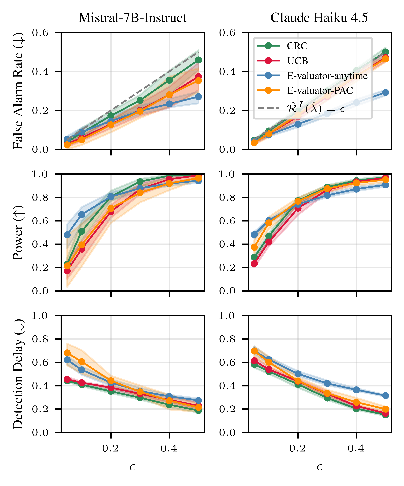

# Online Safety Monitoring for LLMs

This repository contains the code for the paper [Online Safety Monitoring for LLMs](https://arxiv.org/abs/2607.02510) published in the ICML 2026 Workshop on Hypothesis Testing. Given a stream of per-step safety signals, the monitor raises an alarm online if the safety risk becomes too high. The monitor comes with formal false-alarm and missed-detection guarantees.

<p align="center">
  
</p>

## Prerequisites
To set up a conda environment with the required packages, run

```bash
conda env create -f environment.yml
conda activate llm-monitor
pip install -e .          
```

## Supported Monitors

The repository supports the two monitors studied in the paper (CRC and UCB) as well as two [e-valuator](https://arxiv.org/abs/2512.03109) baselines:


Monitor | Guarantee | Formulation | Implementation | 
|---|---|---|---|
Conformal Risk Control (CRC) | Risk is controlled *in expectation*, [Eq 3](https://arxiv.org/pdf/2607.02510#page=2.46) | [Eq 4](https://arxiv.org/pdf/2607.02510#page=2.46) | [`notebooks/compare_monitors.ipynb`](notebooks/compare_monitors.ipynb) 
Upper Confidence Bound (UCB) | Risk is controlled *with high probability*, [Eq 5](https://arxiv.org/pdf/2607.02510#page=2.46)  | [Eq 6](https://arxiv.org/pdf/2607.02510#page=2.46) | [`notebooks/compare_monitors.ipynb`](notebooks/compare_monitors.ipynb) 
E-valuator-anytime | Risk is controlled *with high probability*, [Eq 5](https://arxiv.org/pdf/2607.02510#page=2.46) and [E-valuator, Prop 1 ](https://arxiv.org/pdf/2512.03109#page=4.58) | [E-valuator, Sec. 2.2](https://arxiv.org/pdf/2512.03109#page=3.49) | [`src/evaluator/evaluator.py`](src/evaluator/evaluator.py) 
E-valuator-PAC | Risk is controlled *with high probability uniformly over all time steps*, [E-valuator, Eq 1](https://arxiv.org/pdf/2512.03109#page=3.49) | [E-valuator, Sec. 2.3](https://arxiv.org/pdf/2512.03109#page=4.58) | [`src/evaluator/evaluator.py`](src/evaluator/evaluator.py) 


## Use Cases and Models

We compare monitors on two safety use cases: factuality via mathematical reasoning and harmlessness via red-teaming benchmarks. 

- **Factuality** — Mistral-7B-Instruct and Claude Haiku solving MATH problems, with per-step correctness scored by a process reward model (Qwen-PRM or MathShepherd).
- **Harmlessness** — Anthropic red-team conversations scored by Llama Guard 3, and FineHarm sequences scored by their SCM method.


## Precomputed Data
Precomputed data is available at [this google drive link](https://drive.google.com/file/d/10WougyJRPxhquM-YHUn8WXCq3FbKQHrU/view?usp=sharing). Unzip the output.zip file and add the output folder to the repository as `llm_monitor/output`. 

This contains all metadata needed to compare the monitors without rerunning the pipeline:

```
output/factuality/merged_metadata/
    merged_Mistral-7B-Instruct-v0.3_qwen_all.csv
    merged_Mistral-7B-Instruct-v0.3_mathshepherd_all.csv
    merged_claude-haiku-4-5-20251001_qwen_all.csv
    merged_claude-haiku-4-5-20251001_mathshepherd_all.csv

output/harmfulness/anthropic-redteaming/
    llama.csv

output/harmfulness/fineharm/
    test_predictions.npz          # from FineHarm repo (see below)
```

We also release intermediate outputs for the mathematical reasoning in case this is useful: 
- `output/factuality/raw`: raw output of the generator model
- `output/factuality/formatted`: output of the generator model formatted as step-by-step solutions 
- `output/factuality/critiques`: step-by-step o3-mini labels on the generator traces (note we only use the final label in this work)
- `output/factuality/signal`: the safety signal as provided by a PRM
- `output/factuality/merged_metadata`: aggregated metadata used in notebooks
- `output/factuality/monitor_performance`: monitor run over N seeds of calib / test splits


## Plotting
For plotting the comparison of the monitors across false alarm rate, power and detection delay one can directly use the provided metadata and notebooks without re-running the generation/label pipeline. 

- [`compare_monitors.ipynb`](notebooks/compare_monitors.ipynb): Controlling false alarm risk for factuality and harmfulness across all 4 monitors
- [`missed_detection_risk.ipynb`](notebooks/missed_detection_risk.ipynb): Controlling missed detection risk for factuality. This direction of risk control is only supported by CRC and UCB. 

Both notebooks load cached calibration/test split results from `output/` by default. Set `FACT_FORCE_RECOMPUTE = True` or `HARM_FORCE_RECOMPUTE = True` to recompute results from the metadata csv files.


## Reproducing from scratch

### 1. Monitoring Factuality

To reproduce the results from scratch execute the files in `bash_scripts`. Each bash script runs a script in `python_scripts` with the settings employed in the paper.

The pipeline runs in four stages. All scripts iterate over all seven Hendrycks MATH subjects (`algebra`, `counting_and_probability`, `geometry`, `intermediate_algebra`, `number_theory`, `prealgebra`, `precalculus`).

#### a) Generate reasoning steps

```bash
bash bash_scripts/generate.sh
```

Runs `python_scripts/generate_reasoning.py` on the Hendrycks MATH test set. The default script uses Mistral-7B-Instruct-v0.3. To use a different generator, edit `--generators` and the corresponding model flag, for example:

```bash
# Mistral (default in generate.sh)
python python_scripts/generate_reasoning.py \
    --generators mistral \
    --mistral_model mistralai/Mistral-7B-Instruct-v0.3 \
    --format_mode steps \
    --dataset_name EleutherAI/hendrycks_math \
    --dataset_config algebra \
    --num_problems 2500 \
    --save_formatted output/factuality/formatted


# Qwen (batched, thinking mode)
python python_scripts/generate_reasoning.py \
    --generators qwen \
    --qwen_model Qwen/Qwen2.5-Math-7B-Instruct \
    --format_mode thinking \
    --batch_size 4 \
    --dataset_name EleutherAI/hendrycks_math \
    --dataset_config algebra \
    --num_problems 2500 \
    --save_formatted output/factuality/formatted
```

Formatted traces are saved under `output/factuality/formatted/<model>/`.

#### b) Compute PRM signal

```bash
bash bash_scripts/signal.sh
```

Runs `python_scripts/get_signal_prm.py` to score each reasoning step with a process reward model. The default uses Qwen-PRM (`--prm qwen`); pass `--prm mathshepherd` to use MathShepherd instead. Signals are saved to `output/factuality/signal/`.

#### c) Label with LLM-as-a-judge

```bash
bash bash_scripts/label.sh
```

Runs `python_scripts/label_step.py`, which calls o3-mini (via the OpenAI batch API) to produce step-by-step correctness labels. **The label of the last step is used to assess the final answer.** Output is saved to `output/factuality/critiques/`.

Requires an OpenAI API key at `~/openai_key.txt`.

#### d) Merge PRM signals with labels

```bash
bash bash_scripts/merge.sh
```

Runs `python_scripts/merge_signal_label.py` to join the PRM signal and judge labels into a single CSV per (generator, PRM) combination. Output is saved to `output/factuality/merged_metadata/`.

---

### 2. Monitoring Harmlessness

#### Anthropic red-team dataset

`python_scripts/llama_guard.py` loads the `Anthropic/hh-rlhf` red-team-attempts dataset and scores each conversation prefix with Llama Guard 3-8B. Requires a HuggingFace token with access to the gated model (`--hf-token` flag or `HF_TOKEN` env var).


#### FineHarm

Use the [FineHarm repository](https://github.com/ICTMCG/SCM) to generate predictions, then copy the output file into this repo:

```
output/harmfulness/fineharm/test_predictions.npz
```


## Repository Layout

```
bash_scripts/        Shell scripts for the math-reasoning pipeline
python_scripts/      Python entry points for each pipeline stage
src/evaluator/       Source code of E-valuator baseline
notebooks/           Produce paper figures
templates/           Prompt templates for generation and labeling
output/              Precomputed generations, scoring signals and monitor performance

```

## Acknowledgements

The code is built on top of the [e-valuator](https://github.com/shuvom-s/e-valuator) code base. The Robert Bosch GmbH is acknowledged for financial support.


## Citation 
If you find this work useful, consider citing:
```
@article{schirmer2026online,
  title={Online Safety Monitoring for LLMs},
  author={Schirmer, Mona and Jazbec, Metod and Timans, Alexander and Naesseth, Christian and Waldron, Maja and Nalisnick, Eric},
  journal={ICML 2026 Workshop on Hypothesis Testing},
  year={2026}
}
```

